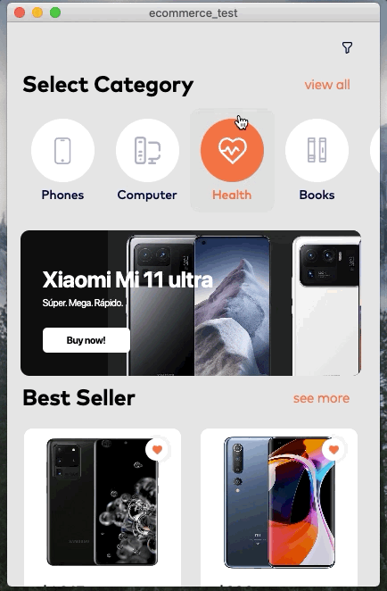
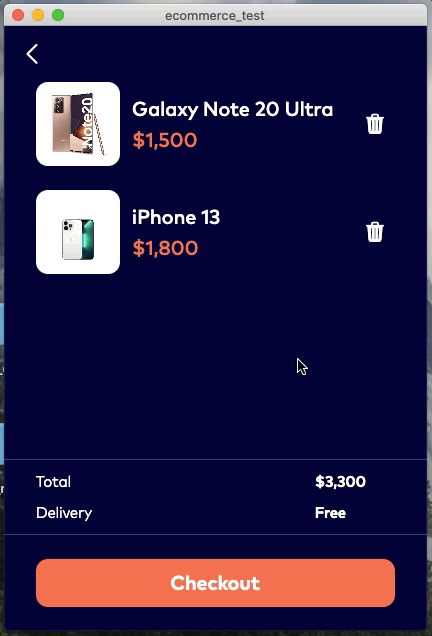
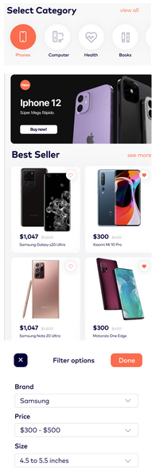
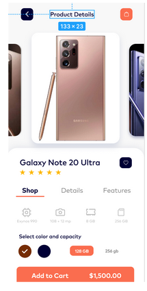
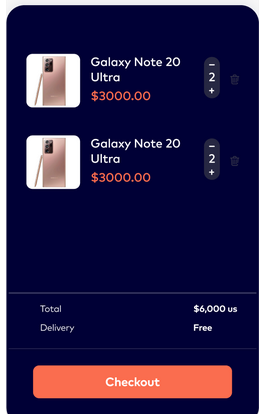

# ecommerce_test

Верстка магазина на Flutter.
Три экрана - главный, детали, корзина.
Данные для отображения экранов загружаются по api.

Фильтрация:

Использованы пакеты:
- flutter_bloc и equatable (состояние экранов)
- flutter_svg (картинки из макета выгружены в svg)
- dio (загрузка данных api)
- intl (форматирование отображения цены)
- badges (количество элементов в корзине)
- flutter_rating_bar (отображение рейтинга в звездах)
- card_swiper (карусель с изображениями)

## Сделано дополнительно

Изначально проект делался максимально приближено к верстке в макете
и к функционалу описанному в изначальном ТЗ. Исходная верстка местами кривоватая,
а в ТЗ есть "пустые" нефункциональные элементы.

По этому я переделал экраны так, чтобы было везде аккуратно и симметрично,
без лишних элементов, а интерактивным элементам добавлен функционал
(категории переключаются - грузят контент, фильтрация - фильтрует список)

Этот код можно найти в ветке [remaster](https://github.com/devmaslove/ecommerce_test/tree/remaster)

## Описание задачи (исходное ТЗ)

Макет:
https://www.figma.com/file/KqZcU5m3GMxAHwgFkvCONz/ECOMMERCE?node-id=2%3A845

[ТЗ](https://docs.google.com/document/d/1VedkRcsN6yukGO2uWES4RuIM8KMtESZ8p7zD7nGySMs/edit?usp=sharing):

### Экран «Main»

API:
GET - https://run.mocky.io/v3/654bd15e-b121-49ba-a588-960956b15175

Общие требования:

Select Category - При нажатию на иконку она меняет цвет (как по дизайну). 
Выбрана и выделенная иконка может быть только одна.

Hot sales - карусель при свайпе вправо меняет элемент:
- Изображение;
- Метка New, появляется только на новых товарах;
- Бренд товара;
- Краткое описание;
- Кнопка купить;

Best Seller - Список товара имеет следующие параметры:
- Название;
- Изображение;
- Цену за шт.: цена с учетом скидки ;
- Цену за шт.: цена без учета скидки ;
- Добавить в избранное ;

Filter options - раскрывающийся список бренда и размера, диапазон цен от 0 до 10000$
Фильтр открывается по нажатии на кнопку в правом верхнем углу

- Brand
- Price
- Size - только отрисовать как в Figma

### Экран «Product Details»

API: ( пример только по одной модели телефона, то есть при нажатии на любой телефон, будет всегда открываться Samsung)

GET - https://run.mocky.io/v3/6c14c560-15c6-4248-b9d2-b4508df7d4f5

Общие требования:
- Изображение - карусель при свайпе вправо меняет элемент;
- Название;
- Метка favorites;
- Рейтинг товара;
- Цвет товара;
- Детали товара;
- Характеристика;
- Добавить в корзину;

### Экран «My Cart»

API:

GET - https://run.mocky.io/v3/53539a72-3c5f-4f30-bbb1-6ca10d42c149

Функционал:
- Пользователь видит в тапбаре иконку корзины.
- Пользователь видит количество добавленных товаров на иконке в тапбаре при условии, что в корзину добавлен один или более товаров.
- Пользователь может перейти в корзину при нажатии на иконку Корзины в тапбаре.

Пользователь видит список добавленных товаров в корзине.
Каждый товар в списке имеет следующие параметры:
- Название;
- Изображение;
- Цену за шт.: цена с учетом скидки ;
- Итоговую цену с учетом количества - данного товара, добавленного в корзину;
- Стоимость доставки;
